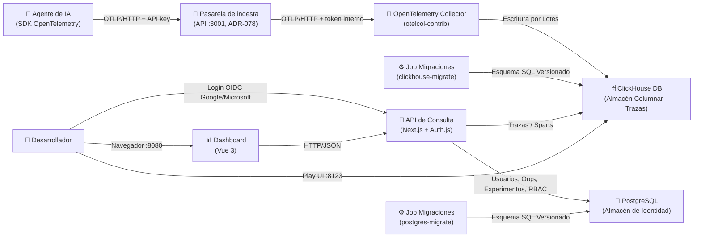

# 🧠⚡ MemTrace

> **Plataforma integrada de observabilidad y aprendizaje para agentes de IA.**

MemTrace es una solución de infraestructura local de código abierto para capturar, almacenar y analizar trazas de ejecución de agentes de Inteligencia Artificial en tiempo real, permitiendo extraer conocimiento iterativo a partir de su comportamiento.

---

## 🌟 Pilares del Proyecto

MemTrace se divide en dos pilares fundamentales:

1. **Trace (Observabilidad):** Captura y almacenamiento columnar de trazas de ejecución bajo el estándar OpenTelemetry (llamadas a LLMs, herramientas/tools utilizadas, latencias, costos e impresiones).
2. **Mem (Memoria y Aprendizaje):** Extracción automatizada de patrones y conocimiento a partir de las trazas para mejorar progresivamente el comportamiento de los agentes.

---

## 🏗️ Arquitectura del Sistema (Fase 1 + 1.5)

El entorno corre íntegramente de forma local sobre **Kubernetes** (`kind` / `k3d`) usando contenedores (**Podman** o **Docker**):



### Componentes Principales:
* **OpenTelemetry Collector:** Recibe trazas solo vía OTLP/HTTP (`4318`) y solo de la pasarela de ingesta de la API, que valida la API key y fija el experimento (ADR-078, ADR-079). Agrupa con cola persistente en disco.
* **ClickHouse Server:** Base de datos columnar optimizada para analítica de trazas de alto rendimiento.
* **ClickHouse Migrations Job:** Orquestador declarativo que aplica migraciones SQL versionadas (`migrations/clickhouse/*.sql`).
* **PostgreSQL:** Almacén de identidad transaccional (usuarios, organizaciones, experimentos, memberships y sesiones), independiente de ClickHouse — ver [ADR-013](docs/adrs/identity/adr-013-identity-postgres-and-oauth-rbac.md).
* **Postgres Migrations Job:** Aplica migraciones SQL versionadas del esquema de identidad (`migrations/postgres/*.sql`).
* **API de Consulta:** Next.js + Auth.js; único punto de acceso a ClickHouse y PostgreSQL, gestiona login OIDC (Google/Microsoft) y autorización RBAC de 2 niveles (organización/experimento).
* **Kustomize & Kubernetes:** Definición declarativa de infraestructura en [`k8s/`](k8s/) y [`kustomization.yaml`](kustomization.yaml).

### Modelo de Datos de Identidad (PostgreSQL)

Almacén transaccional independiente de ClickHouse, con integridad referencial (ver [ADR-013](docs/adrs/identity/adr-013-identity-postgres-and-oauth-rbac.md)):

* **`users` / `accounts` / `sessions` / `verification_token`:** tablas estándar del adaptador de Auth.js (login federado, sin contraseñas propias).
* **`organizations`:** unidad de aislamiento multi-tenant; agrupa cualquier número de experimentos.
* **`experiments`:** vista de trazas/dashboard de un agente instrumentado (mapea a `service.name` de OTel); pertenece a una única organización.
* **`org_memberships`:** rol `org_admin` sobre una organización — admin implícito de todos sus experimentos.
* **`experiment_memberships`:** rol `admin` o `member` sobre un experimento concreto.

RBAC de 2 niveles sin rol global: un usuario puede actuar sobre un experimento si es `org_admin` de su organización, o tiene membership directa en ese experimento.

---

## 🚀 Inicio Rápido (Quickstart)

### Requisitos Previos
Asegúrate de tener instalados:
* **Podman** (o Docker Desktop)
* **`kind`** (Kubernetes in Docker/Podman)
* **`kubectl`**

### 1. Iniciar el motor de contenedores
Si usas Podman en macOS:
```bash
podman machine start
```

### 2. Levantar el proyecto (1 solo comando)
Ejecuta el siguiente comando en la raíz del proyecto:

```bash
make up
```

✨ **Este único comando:**
1. Comprueba y crea el clúster de Kubernetes (`memtrace-cluster`).
2. Construye las imágenes de la API y del dashboard y las carga en el clúster.
3. Despliega todos los recursos y aplica las migraciones de base de datos.
4. Espera a que ClickHouse, el Colector, la API y el dashboard estén 100% disponibles.
5. **Redirige automáticamente los puertos a tu máquina local.**

Cuando termine, abre el dashboard en **http://localhost:8080**.

---

## 📊 Acceso a las Interfaces y Servicios

Una vez ejecutado `make up`, tendrás acceso directo a:

* 📊 **Dashboard:** [http://localhost:8080](http://localhost:8080) (nginx sirve la app y reenvía `/api` a la API; ADR-014)
* 🔌 **API de consulta:** `http://localhost:3001` (la usan el SDK y los `examples/` a través de `MEMTRACE_API_URL`)
* 📖 **Documentación pública:** [http://localhost:8081](http://localhost:8081) (`docs-site/`; ADR-020)
* 🌐 **UI Web de ClickHouse (Play):** [http://localhost:8123/play](http://localhost:8123/play)
  * **Usuario:** `default`
  * **Contraseña:** `memtrace-dev-only`
  * **Base de Datos:** `memtrace`
* 📡 **Endpoint de ingesta OTLP/HTTP:** `http://localhost:8080/api/v1/ingest` (con una API key; el Collector ya no se expone fuera del clúster)

### Probar con trazas

```bash
pip install -e sdk/python   # una vez: el SDK de Python
export MEMTRACE_API_KEY=mtk_...   # Admin → experimento → API keys
make dev-data               # agente simulado que envía trazas a la pasarela de ingesta
```

Tu propio agente apunta a la pasarela (`MEMTRACE_OTLP_ENDPOINT=http://localhost:8080/api/v1/ingest`, `MEMTRACE_OTLP_PROTOCOL=http/protobuf`) y envía su API key en `MEMTRACE_OTLP_HEADERS`; ver [`sdk/python/README.md`](sdk/python/README.md). Las trazas que lleguen sin pasar por la pasarela no tienen experimento y nadie puede verlas. El dashboard se actualiza solo (por defecto cada 5 s).

### Ver tus cambios de código

Si cambias código de la API o del dashboard:

```bash
make images     # reconstruye las imágenes, las carga en el clúster y reinicia los pods (1-2 min)
# el port-forward del dashboard apuntaba al pod anterior: rehazlo
pkill -f "kubectl port-forward svc/dashboard"; kubectl port-forward svc/dashboard 8080:8080 -n memtrace &
```

Después recarga http://localhost:8080 con recarga forzada (Ctrl/Cmd+Shift+R). Si el código no compila, `make images` falla y el clúster sigue con la versión anterior.

Para iterar más rápido sobre el dashboard sin reconstruir imágenes: `kubectl port-forward svc/api 3001:3001 -n memtrace &` y, en `dashboard/`, `npm install && npm run dev` (http://localhost:5173, con proxy a la API del clúster).

Detalles en [`api/README.md`](api/README.md) y [`dashboard/README.md`](dashboard/README.md).

---

## 🛠️ Comandos del `Makefile`

El proyecto incluye un `Makefile` interactivo para gestionar fácilmente el ciclo de vida:

| Comando | Descripción |
| :--- | :--- |
| **`make up`** | Levanta todo el entorno en 1 paso (clúster, despliegue, migraciones, puertos y el asistente del tiempo en http://localhost:8000, que se relanza para releer el `.env`). |
| **`make weather-stop`** | Para el asistente del tiempo lanzado en segundo plano (`make down` también lo para). |
| **`make status`** | Muestra el estado de los Pods, PVCs (volúmenes) y Jobs de migración. |
| **`make query`** | Ejecuta una consulta de prueba en ClickHouse mostrando trazas y spans registrados. |
| **`make forward`** | Vuelve a iniciar la redirección de puertos en primer plano si fuera necesario. |
| **`make logs`** | Muestra los registros (*logs*) en tiempo real del OpenTelemetry Collector. |
| **`make migrate`** | Re-ejecuta de forma manual las migraciones de base de datos. |
| **`make dashboard`** / **`make api`** | Reconstruyen y despliegan solo el dashboard o solo la API (más rápido que `make images`). |
| **`make images`** | Reconstruye las imágenes de la API y el dashboard, las carga en el clúster y reinicia sus pods. |
| **`make dev-data`** | Genera trazas de ejemplo con un agente simulado. |
| **`make docs`** | Sitio de documentación en modo desarrollo con recarga en caliente (http://localhost:5174). `make up` ya lo sirve en http://localhost:8081. |
| **`make down`** | Detiene el clúster conservando todos los datos guardados. |
| **`make reset`** | **Elimina** por completo el clúster de Kubernetes y sus volúmenes de datos. |

---

## 📂 Estructura del Repositorio

```text
MemTrace/
├── k8s/                        # Manifiestos de Kubernetes (Namespace, StatefulSet, Deployment, Services)
│   ├── 00-namespace.yaml
│   ├── 10-clickhouse-secret.yaml
│   ├── 20-clickhouse.yaml
│   ├── 30-clickhouse-migrations.yaml
│   ├── 40-otel-collector.yaml
│   ├── 50-api.yaml             # API de consulta (Deployment + Service)
│   ├── 60-dashboard.yaml       # Dashboard servido por nginx (Deployment + Service)
│   ├── 70-docs.yaml            # Sitio de documentación pública (nginx)
│   ├── 80-topic-extraction.yaml # CronJob de temáticas de respuestas (ADR-022)
│   └── config/                 # Configuración de ClickHouse (ConfigMap generado por kustomize)
├── sdk/python/                 # SDK Python (memtrace-ai en PyPI, import memtrace): decoradores + integración LangChain, exporta OTLP
├── api/                        # API de consulta (Next.js + TypeScript): único acceso a ClickHouse
├── dashboard/                  # Dashboard (Vite + Vue 3 + Quasar): consume solo la API
├── analytics/topic_extraction/ # Worker de temáticas (BERTopic, sin LLM): enriquece trazas de forma asíncrona (ADR-022)
├── docs-site/                  # Sitio público docs.memtraces.ai (VitePress): librería + plataforma; independiente del dashboard
├── examples/                   # Ejemplos de agentes instrumentados
├── migrations/                 # Migraciones SQL versionadas
│   ├── clickhouse/              # Esquema de trazas (columnar)
│   │   └── 001_init_traces.sql
│   └── postgres/                # Esquema de identidad (transaccional)
│       └── 001_init_identity.sql
├── docs/                       # Documentación técnica y decisiones de diseño (ADRs)
│   ├── roadmap.md
│   ├── phase_1_design.md
│   └── adrs/                   # Architecture Decision Records
├── kustomization.yaml          # Configuración de Kustomize
├── Makefile                    # Automatización de tareas de desarrollo
└── README.md                   # Documentación principal
```

---

## 👥 Alta de un usuario nuevo

1. La persona entra al dashboard ([http://localhost:8080](http://localhost:8080)) y se autentica con Google o Microsoft (OIDC vía Auth.js). No hay registro con contraseña: el primer login crea su cuenta automáticamente.
2. **Si no pertenece a ninguna organización todavía**, cualquier usuario autenticado puede crear una y se convierte en su primer `org_admin`.
3. **Para añadir a alguien a una organización o experimento ya existente**, un `org_admin` (o un `admin` del experimento) lo invita por email, antes de que esa persona haya iniciado sesión nunca:

   ```bash
   # Invitar como org_admin de una organización
   curl -X POST http://localhost:3001/api/v1/organizations/{organizationId}/members \
     -H "Content-Type: application/json" \
     -d '{"email": "nueva.persona@empresa.com"}'

   # Invitar como admin/member de un experimento concreto
   curl -X POST http://localhost:3001/api/v1/experiments/{experimentId}/members \
     -H "Content-Type: application/json" \
     -d '{"email": "nueva.persona@empresa.com", "role": "member"}'
   ```

   Si la persona invitada ya tiene cuenta, el rol se asigna al momento (`201`). Si no, queda como invitación pendiente (`202`) y se le envía un email pidiéndole que inicie sesión; el rol se aplica automáticamente en su primer login.

   El envío de email usa [Resend](https://resend.com/), configurado con `RESEND_API_KEY` y `EMAIL_FROM` en `.env`. Sin esas variables, la invitación se registra pero el email no se envía (solo se loguea un aviso) — útil en local, pero hay que configurarlas para invitar a alguien que no vaya a mirar los logs.

## 🤖 Alta de un agente nuevo

Cada agente instrumentado envía trazas al Collector autenticándose con una API key ligada a un experimento concreto.

1. Un `admin` u `org_admin` del experimento genera la key:

   ```bash
   curl -X POST http://localhost:3001/api/v1/experiments/{experimentId}/api-keys
   # -> 201 { "id": "...", "keyPrefix": "mtk_Ab3xY9", "plaintext": "mtk_Ab3xY9...", ... }
   ```

   El valor de `plaintext` solo se devuelve en este momento — guárdalo, no se puede recuperar después (solo se persiste su hash).

2. El agente debe enviar esa key como header `Authorization: Bearer <key>` en cada request OTLP/HTTP. El SDK de Python no tiene todavía una opción dedicada para esto: pásala vía la variable estándar de headers OTLP:

   ```bash
   export MEMTRACE_OTLP_HEADERS="authorization=Bearer mtk_Ab3xY9..."
   ```

   *(Pendiente: añadir un parámetro `api_key` de primera clase al SDK en vez de depender de este workaround.)*

3. La API valida la key contra el almacén de identidad antes de reenviar la traza al Collector; una key inválida o revocada se rechaza con 401. La pasarela sustituye `service.name` y `memtrace.experiment_id` por los del experimento de la key (ADR-078).

---

## 📚 Documentación Adicional

* 🗺️ [**Roadmap del Proyecto**](docs/roadmap.md) — Visión completa y fases de desarrollo.
* 📐 [**Diseño Técnico de la Fase 1**](docs/phase_1_design.md) — Detalles de instrumentación, ingestión y almacenamiento.
* 📜 [**ADRs (Architecture Decision Records)**](docs/adrs/) — Decisiones de arquitectura tomadas.
