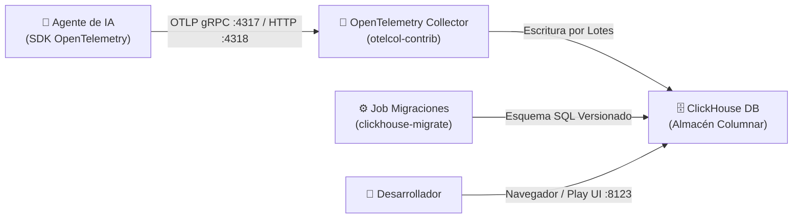

# 🧠⚡ MemTrace

> **Plataforma integrada de observabilidad y aprendizaje para agentes de IA.**

MemTrace es una solución de infraestructura local de código abierto para capturar, almacenar y analizar trazas de ejecución de agentes de Inteligencia Artificial en tiempo real, permitiendo extraer conocimiento iterativo a partir de su comportamiento.

---

## 🌟 Pilares del Proyecto

MemTrace se divide en dos pilares fundamentales:

1. **Trace (Observabilidad):** Captura y almacenamiento columnar de trazas de ejecución bajo el estándar OpenTelemetry (llamadas a LLMs, herramientas/tools utilizadas, latencias, costos e impresiones).
2. **Mem (Memoria y Aprendizaje):** Extracción automatizada de patrones y conocimiento a partir de las trazas para mejorar progresivamente el comportamiento de los agentes.

---

## 🏗️ Arquitectura del Sistema (Fase 1)

El entorno corre íntegramente de forma local sobre **Kubernetes** (`kind` / `k3d`) usando contenedores (**Podman** o **Docker**):



### Componentes Principales:
* **OpenTelemetry Collector:** Recibe trazas vía OTLP (puertos `4317` gRPC / `4318` HTTP), agrupadamente con cola persistente en disco.
* **ClickHouse Server:** Base de datos columnar optimizada para analítica de trazas de alto rendimiento.
* **ClickHouse Migrations Job:** Orquestador declarativo que aplica migraciones SQL versionadas (`migrations/clickhouse/*.sql`).
* **Kustomize & Kubernetes:** Definición declarativa de infraestructura en [`k8s/`](k8s/) y [`kustomization.yaml`](kustomization.yaml).

---

## 🚀 Inicio Rápido (Quickstart)

### Requisitos Previos
Asegúrate de tener instalados:
* **Podman** (o Docker Desktop)
* **`kind`** (Kubernetes in Docker/Podman)
* **`kubectl`**

### 1. Iniciar el motor de contenedores
Si usas Podman en macOS:
```bash
podman machine start
```

### 2. Levantar el proyecto (1 solo comando)
Ejecuta el siguiente comando en la raíz del proyecto:

```bash
make up
```

✨ **Este único comando:**
1. Comprueba y crea el clúster de Kubernetes (`memtrace-cluster`).
2. Despliega todos los recursos y aplica las migraciones de base de datos.
3. Espera a que ClickHouse y el Colector estén 100% disponibles.
4. **Redirige automáticamente los puertos a tu máquina local.**

---

## 📊 Acceso a las Interfaces y Servicios

Una vez ejecutado `make up`, tendrás acceso directo a:

* 🌐 **UI Web de ClickHouse (Play):** [http://localhost:8123/play](http://localhost:8123/play)
  * **Usuario:** `default`
  * **Contraseña:** `memtrace-dev-only`
  * **Base de Datos:** `memtrace`
* 📡 **Endpoint OTLP Collector (gRPC):** `localhost:4317`
* 🌐 **Endpoint OTLP Collector (HTTP):** `localhost:4318`

---

## 🛠️ Comandos del `Makefile`

El proyecto incluye un `Makefile` interactivo para gestionar fácilmente el ciclo de vida:

| Comando | Descripción |
| :--- | :--- |
| **`make up`** | Levanta todo el entorno en 1 paso (clúster, despliegue, migraciones y puertos). |
| **`make status`** | Muestra el estado de los Pods, PVCs (volúmenes) y Jobs de migración. |
| **`make query`** | Ejecuta una consulta de prueba en ClickHouse mostrando trazas y spans registrados. |
| **`make forward`** | Vuelve a iniciar la redirección de puertos en primer plano si fuera necesario. |
| **`make logs`** | Muestra los registros (*logs*) en tiempo real del OpenTelemetry Collector. |
| **`make migrate`** | Re-ejecuta de forma manual las migraciones de base de datos. |
| **`make down`** | Detiene el clúster conservando todos los datos guardados. |
| **`make reset`** | **Elimina** por completo el clúster de Kubernetes y sus volúmenes de datos. |

---

## 📂 Estructura del Repositorio

```text
MemTrace/
├── k8s/                        # Manifiestos de Kubernetes (Namespace, StatefulSet, Deployment, Services)
│   ├── 00-namespace.yaml
│   ├── 10-clickhouse-secret.yaml
│   ├── 20-clickhouse.yaml
│   ├── 30-clickhouse-migrations.yaml
│   ├── 40-otel-collector.yaml
│   └── config/                 # Configuración de ClickHouse (ConfigMap generado por kustomize)
├── sdk/python/                 # SDK Python (memtrace): decoradores + integración LangChain, exporta OTLP
├── api/                        # API de consulta (Next.js + TypeScript): único acceso a ClickHouse
├── examples/                   # Ejemplos de agentes instrumentados
├── migrations/                 # Migraciones SQL versionadas para ClickHouse
│   └── clickhouse/
│       └── 001_init_traces.sql
├── docs/                       # Documentación técnica y decisiones de diseño (ADRs)
│   ├── roadmap.md
│   ├── phase_1_design.md
│   └── adrs/                   # Architecture Decision Records
├── kustomization.yaml          # Configuración de Kustomize
├── Makefile                    # Automatización de tareas de desarrollo
└── README.md                   # Documentación principal
```

---

## 📚 Documentación Adicional

* 🗺️ [**Roadmap del Proyecto**](docs/roadmap.md) — Visión completa y fases de desarrollo.
* 📐 [**Diseño Técnico de la Fase 1**](docs/phase_1_design.md) — Detalles de instrumentación, ingestión y almacenamiento.
* 📜 [**ADRs (Architecture Decision Records)**](docs/adrs/) — Decisiones de arquitectura tomadas.
